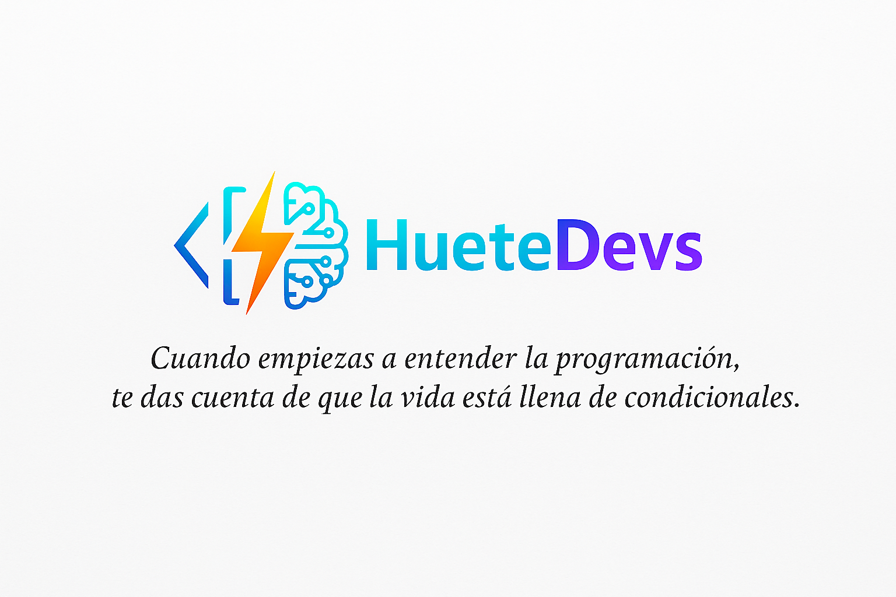

<p align="center">
  
</p>


# 🐍 Ejercicios de Python — Desde Nivel Básico hasta Avanzado  

> ✨ *Colección progresiva de ejercicios en Python para practicar lógica, sintaxis y fundamentos de programación.*  


---

## 📘 Descripción del proyecto

Este repositorio contiene una serie de **ejercicios prácticos de Python** diseñados para **aprender desde cero hasta un nivel intermedio-avanzado**.  
El objetivo es reforzar los conocimientos básicos y construir una base sólida para afrontar retos más complejos.

📈 **Estructura progresiva:** de variables y condicionales hasta bucles anidados y operaciones con datos.  
🧩 **Enfoque:** totalmente práctico, con ejemplos claros y comentados.  
🔁 **Actualización:** se añadirán nuevos ejercicios con frecuencia.

---

## 🗂️ Estructura del repositorio

| Nº | 🧠 Tema principal | 📝 Descripción breve |
|----|------------------|---------------------|
| **1** | [variables](variables.py) | Declarar variables de distintos tipos y mostrarlas por consola. | 
| **2** | [Reasignación](reasignacion_variables.py) | Modificar el valor de una variable y mostrar el resultado. |
| **3** | [Conversión de tipos](conversion_tipos.py) | Convertir enteros y flotantes a cadenas (`str`) y mostrar sus tipos. |
| **4** | [Entrada de usuario](entrada_usuario) | Leer un valor desde teclado (`input`) y mostrarlo. |
| **5** | [Condicionales](condicionales.py) | Determinar si una variable es `int` o `str`. |
| **6** | [Comparación](comparacion_positivo_negativo.py) | Verificar si un número es positivo o negativo. |
| **7** | [Mayoría de edad](mayoria_edad.py) | Comprobar si el usuario es mayor o menor de 18 años. |
| **8** | Bucles `for` y `while` | Mostrar números del 1 al 20 con ambos bucles. |
| **9** | Números impares | Imprimir solo los impares entre 10 y 20. |
| **10** | Bucles anidados | Crear un triángulo numérico creciente según altura. |
| **11** | Contador ascendente | Mostrar del 1 al 50 con un `for`. |
| **12** | Contador descendente | Mostrar del 20 al 1 con un `while`. |
| **13** | Pares con `range()` | Imprimir los pares del 2 al 40. |
| **14** | Suma acumulada | Pedir 5 números al usuario y sumar todos. |
| **15** | Bucles anidados_2 | Rectángulo de asteriscos (*) dado ancho y alto. |
| **16** | Bucles anidados_3 | Triángulo invertido de números. |
| **17** | Funciones | Función que calcula el área de un círculo. |
| **18**| [Comprensión de listas](listas_1.py) | Creación de lista del 1-10|
---

## 🧠 Objetivo del proyecto

✔️ Practicar y consolidar los **fundamentos de Python**  
✔️ Desarrollar la **lógica algorítmica** paso a paso  
✔️ Preparar el terreno para **proyectos más avanzados**  
✔️ Generar una **rutina de práctica constante**  

---

## 🚀 Cómo usar el repositorio

1. Clona este repositorio en tu equipo:
   ```bash
   git clone https://github.com/HueteDevs/Ejercicios-de-Python
 
## 🛠️ Requisitos:

🐍 Python 3.8 o superior

💻 Editor de texto o IDE (VS Code, PyCharm, Thonny, etc.)

## 📅 Próximas actualizaciones

🚧 Próximamente se añadirán nuevos bloques de ejercicios:

🔜 Listas, tuplas y diccionarios

🔜 POO (Programación Orientada a Objetos)

🔜 Mini proyectos de lógica y juegos simples

## ✍️ Autor

👨‍💻 Iñaki Huete | HueteDevs

🎓 Estudiante de Python + IA

📍 España

## 💬 "El aprendizaje constante es la clave del progreso. Estos ejercicios son parte de mi camino en la programación y los comparto para ayudar a otros a empezar."

## 👍 Cómo apoyar el proyecto

Si este repositorio te resulta útil:

⭐ Dale una estrella en GitHub

🔁 Compártelo con otros estudiantes

💡 Propón nuevos ejercicios o mejoras mediante issues o pull requests


